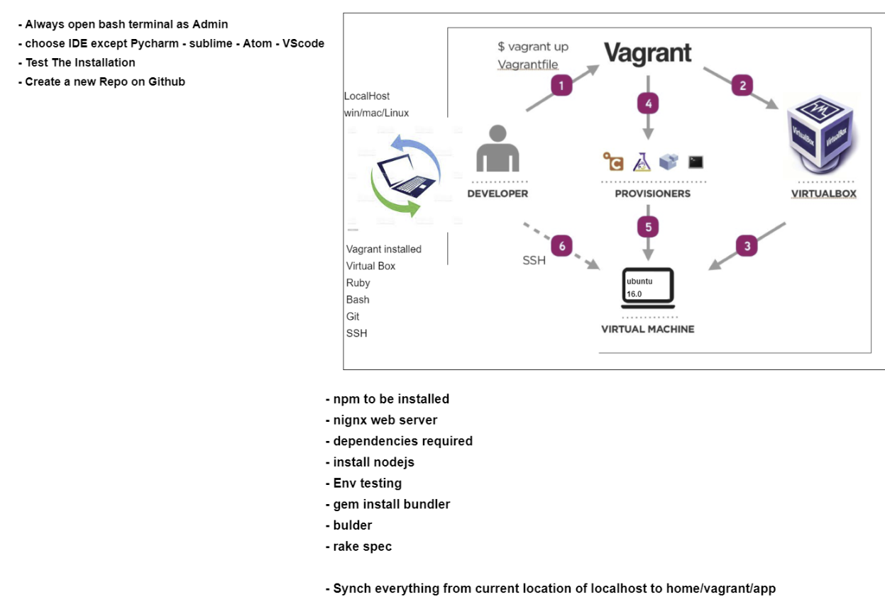
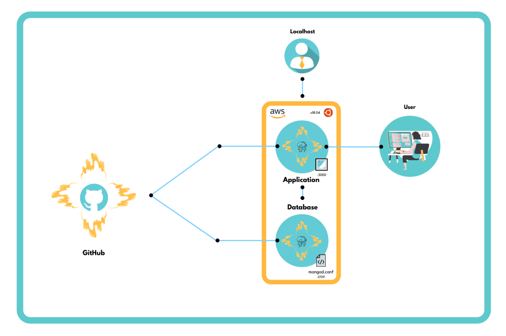

# Pre-requisites:
Go on "Turn Windows Features On and Off", disable Hyper-V. <br><br>
If it gives a virtualisation error upon using "`vagrant up`" (e.g. amd-v not enabled), go into bios and enable SVM or AMD-V.<br><br>
Add the `.vagrant/` directory into `.gitignore` (the directory where you will install the vagrant VM).
<br><br>

# Install Ruby 
https://github.com/oneclick/rubyinstaller2/releases/download/RubyInstaller-2.6.6-1/rubyinstaller-devkit-2.6.6-1-x64.exe
<br>
Type `Ruby --version` to check if it's installed.
<br><br>

# Install Vagrant 
https://www.vagrantup.com/
<br>
Type `Vagrant --version` to check if it's installed.
<br><br>
# Install VirtualBox 
https://www.virtualbox.org/wiki/Downloads
<br>
Go to the drivers directory which is by default: <br>(C:\Program Files\Oracle\VirtualBox\drivers)
<br>
Open vboxdrv or vboxsup (whichever is available), right click VBoxDrv.inf or VBoxSup.inf and click install. Then go into terminal and type `sc start xboxdrv` or `sc start vboxsup` depending on which directory was available. <br><br>
Control Panel -> Network and Internet -> Network and Sharing Centre -> Change Adapter settings -> Right click VirtualBox Host-Only Network -> Properties -> Install -> Service -> Manufacturer: Oracle Corporation -> Network service: VirtualBox NDIS6 Bridged Networking Driver.
<br><br>

# Launching Vagrant
Launch Terminal (like GitBash) with `admin privileges` and `cd` into the target directory. Make sure you copy and paste the `Vagrantfile` in this folder into the target directory where you want to install/launch vagrant. Afterwards, write:<br>
`vagrant init`<br>
`vagrant up`<br>
<br>
This should install and launch vagrant. If there's a virtualisation error, refer to the pre-requisites. 
<br><br>

# Using Vagrant
To create a VM: `vagrant up`<br>
To check the status of vagrant: `vagrant status`<br>
To delete the VM: `vagrant destroy`<br>
To shut the vagrant VM down: `vagrant halt`<br>
To reboot the vagrant VM: `vagrant reload`<br>
To access the VM shell: `vagrant ssh`<br>
To access a remote VM shell: `vagrant ssh xxx.xxx.xxx.xxx`, where xxx.xxx.xxx.xxx is an IP address.
<br><br>

# Setting up Ubuntu
How to use the apt-get package manager:<br>
`sudo apt-get install/update/upgrade/remove package -y`<br>
E.g.: `sudo apt-get install nginx -y`<br>
<br>

The following 3 commands are automatically completed by Vagrantfile, but they're useful to know anyway:<br>
`sudo apt-get update`<br>
`sudo apt-get upgrade -y`<br>
`sudo apt-get install nginx -y`<br>
<br>

Useful commands to interact with the system:<br>
`systemctl status/restart/start/stop object`<br>
`systemctl status nginx`<br><br>


# Linux Basics
To find out system information (such as distro, date, etc): `uname -a`<br>
To name the current directory we're in: `pwd`<br>
To list files in the current directory: `ls -a`<br>
To create a directory: `mkdir name-of-directory`<br>
Navigate to a different directory: `cd directory`, where `..` is previous directory, e.g. `cd ..`<br>
To create a file: `touch name-of-file`<br>
To display the contents of a file: `cat name-of-file`<br>
To delete a file: `rm -rf name-of-file-or-directory`<br>
To copy a file: `cp target-file-name location`<br>
To move a file: `mv source-file-name target-location-name`<br>
To list current active processes: `top`<br>
To check file permissions: `ll`<br>
To change file permissions: `chmod permission name-of-file`<br>


# Setting up the Virtual Environment
On the localhost, cd into Vagrant/environment/spec-tests and perform these two commands:<br>
`gem install bundler`<br>
`bundle`<br>
Which will install a few pre-requisites on the localhost.<br><br>

The command `rake spec` while in the spec-tests/ directory will perform a series of checks to see if you have the pre-requisites required to successfully launch the application. If there are any missing after this guide, they will need to be installed for the app to work.<br><br>

I've automated all of the installations required inside the Unbuntu VM and put them into the `provisions.sh` shell file, which is coded to automatically launch whenever `vagrant up` is called. These include:<br><br>
- `sudo apt-get update -y`
- `sudo apt-get upgrade -y`
- `sudo apt-get install nginx -y`
- `sudo apt-get install npm -y`
- `curl -sl https://deb.nodesource.com/setup_6.x | sudo -E bash -`
- `sudo apt-get install nodejs -y`
- `sudo npm install pm2 -g`
<br><br>

Now, all the pre-requisites have been successfully installed and the application can be launched.<br><br>
The launch of this application can now be automated.<br><br>
We can do this by using `cd` to move into the Vagrant/app folder inside the vm (where the app's directory is located).<br><br>
From here, if we `npm install` and `npm start`, the application launches but the terminal hangs.<br><br>
To avoid this, we install the forever module by using `npm install forever -g`.<br><br>
Then we use `npm install` normally in the app directory, and then use the forever module like this: `forever start app.js` to launch the app with `forever`.<br><br>
This makes it so that the app launches in the background and doesn't make the terminal hang.<br><br>

- `cd /srv/provisioning/Vagrant/app`
- `npm install forever -g`
- `npm install`
- `forever start app.js`<br>

I've also added a section in the `Vagrantfile` to run two VM machines at once.<br><br>
One is called `app` and one is called `db`.<br><br>
This was done by defining two different VM's and passing them through to be used to assign the operating system, private networks, synced folders and a provisions file:<br><br>

```
config.vm.define "app" do |app`
    app.vm.box = "ubuntu/xenial64"
    app.vm.network "private_network", ip: "192.168.10.100"
    app.vm.provision "shell", path: "provision.sh", privileged: false 
    app.vm.synced_folder "../","/srv/provisioning"
end
config.vm.define "db" do |db|
    db.vm.box = "ubuntu/xenial64"
    db.vm.network "private_network", ip: "192.168.10.150"
end
```
<br>

# Linux Variables
Creating a linux variable: `FIRST_NAME=SHAHRUKH`<br>
Printing out the variable: `echo $FIRST_NAME`<br>
Viewing the environment variables: `printenv VAR_NAME` and `env`, e.g. `printenv PATH`<br>
Creating an environment variable: `export VAR_NAME`, e.g. `export LAST_NAME=SMITH`<br>
Deleting an environment variable: `unset VAR_NAME`, e.g. `unset LAST_NAME`<br>
Keeping an environment variable persistent: Set it inside `~/.bash_profile`

Connecting to the DB with Linux:
```
// connect to database
if(process.env.DB_HOST) {
  mongoose.connect(process.env.DB_HOST);

  app.get("/posts" , function(req,res){
      Post.find({} , function(err, posts){
        if(err) return res.send(err);
        res.render("posts/index" , {posts:posts});
      })
  });
}
```
<br>

# Setting up a Reverse Proxy
We're going to use reverse proxying so that any traffic to the target IP address (`192.168.10.100`) is automatically redirected to the application, which is hosted on hosted on `port 3000` (`192.168.10.100:3000`).<br><br>
We're doing this by created a file called `default` and setting up an nginx configuration that listens to any traffic from `port 80` and redirects it to `port 3000`.<br><br>
In the provisioning shell file, we'll copy that file and move it into `/etc/nginx/sites-available/` to replace the nginx config file there with our own one.<br><br>
We do this by using: `sudo cp /srv/provisioning/vagrant/default /etc/nginx/sites-available/`.<br><br>
Having edited the nginx configuration, we can restart nginx to apply the chances. We restart nginx with the command `sudo systemctl restart nginx`.<br><br>
Now we run the application as normal, and the reverse proxy should be working perfectly fine, redirecting traffic from `192.168.10.100` to `192.168.10.100:3000`.<br><br>

# Setting up MongoDB

We `vagrant ssh db` to specifically launch the second VM.<br>
We try `sudo apt-get update -y` to double check this VM has internet access.<br><br>


Now we run the following command to add a keyserver for mongodb:<br>
`sudo apt-key adv --keyserver hkp://keyserver.ubuntu.com:80 --recv D68FA50FEA312927`<br><br>

Then we grab this specific version of mongodb:<br>
`echo "deb https://repo.mongodb.org/apt/ubuntu xenial/mongodb-org/3.2 multiverse" | sudo tee /etc/apt/sources.list.d/mongodb-org-3.2.list`<br><br>

Refresh the package-manager: <br>
`sudo apt-get update -y`<br>
`sudo apt-get upgrade -y`<br>

We now install the 3.2.20 version of mongodb:<br>
`sudo apt-get install -y mongodb-org=3.2.20 mongodb-org-server=3.2.20 mongodb-org-shell=3.2.20 mongodb-org-mongos=3.2.20 mongodb-org-tools=3.2.20`

Now, the database has been installed. We have to change our ip on the mongodb config file to `0.0.0.0` from `127.0.0.1`, we can use a single-line command to search for instances of '127.0.0.1' and replace them with '0.0.0.0':<br>
`sudo sed -i 's/127.0.0.1/0.0.0.0/' /etc/mongod.conf`<br><br>

# Amazon Web Services (AWS)

The AWS Cloud spans 84 Availability Zones within 26 geographic regions around the world, with announced plans for 24 more Availability Zones and 8 more AWS Regions in Australia, Canada, India, Israel, New Zealand, Spain, Switzerland, and United Arab Emirates (UAE).<br><br>

Provides IaaS, PaaS and SaaS:
- IaaS: Infrastructure as a Service
- PaaS: Platform as a Service
- SaaS: Software as a Service

<br>
EC2 (Elastic Compute Cloud) allows us to rent a virtual machine with the OS of your choice, so we don't have to set everything up ourselves from dependencies to virtualbox to provisioning and security. Important for migrating to the cloud, as well as not having to worry about power requirements, space considerations, expensive computer hardware, security, and software updates. 
<br><br>

# Setting Up AWS



OS: Ubuntu Server 18.04<br>
Architecture: x86<br>
Instance Type: t2 Micro<br>
Subnet: DevOps 103a<br>
Inbound rules: HTTP: my IP, custom TCP at port 3000, SSH at port 22 (to access)
               
Key is required to access the EC2 machine, save key as `keyname.pem` and move it into `~/.ssh`. Select connect on EC2, and copy the SSH login commands into terminal (after CD'ing into `~/.ssh`.<br>


After logging in, we need to move our data into the EC2 machine.<br>
`sudo apt-get install subversion -y`<br>
`sudo svn GitHubTrunkLink`<br>
These commands will download a specific trunk (folder) of our GitHub project into the machine. I'll be copying the entire Vagrant folder, and then using `rm -rf filename` to delete unneeded files, such as `Vagrantfile`.<br>
<br> Alternatively, can use the SCP command to move data directly from our computer into the vm, seems to be more secure: <br>
`scp -i eng103a.pem -r ~/devops103a/Vagrant/ ubuntu@ec2-3-250-15-190.eu-west-1.compute.amazonaws.com:~`<br>

Next, we install nginx again:<br>
`sudo apt-get install nginx -y`<br>

If you access the public IP now, it'll show the nginx home page.<br>
However, if we launch the application (after installing all the dependencies), we won't be able to access the app at port 3000.<br>
This is because the port is blocked, and we need to open it.<br><br>
On the AWS website, enter the security tab on your instance, security groups and edit inbound rules. Add Custom TCP connection at port 3000 for any IPv4 address.<br><br>

Now if you `npm start` the application, you should be able to see the app running at port 3000 on the public IP.


Next, we create another EC2 for MongoDB<br>
OS: Ubuntu Server 18.04<br>
Architecture: x86<br>
Instance Type: t2 Micro<br>
Subnet: DevOps 103a<br>
Inbound rules: Custom TCP: 27017 any IP, SSH at port 22 (to access)<br><br>
Start by updating and upgrading the repos as usual:<br>
`sudo apt-get update -y && sudo apt-get upgrade -y`<br><br>
Then we'll assign the keyserver onto our system:<br>
`sudo apt-key adv --keyserver hkp://keyserver.ubuntu.com:80 --recv D68FA50FEA312927`<br><br>
And now we grab the specific 3.2 version of MongoDB from their online repository:<br>
`echo "deb https://repo.mongodb.org/apt/ubuntu xenial/mongodb-org/3.2 multiverse" | sudo tee /etc/apt/sources.list.d/mongodb-org-3.2.list`<br><br>
Since we've just grabbed new packages from a repository, let's update and upgrade again:<br>
`sudo apt-get update -y && sudo apt-get upgrade -y`<br><br>
And now we can finally install MongoDB 3.2.20:<br>
`sudo apt-get install -y mongodb-org=3.2.20 mongodb-org-server=3.2.20 mongodb-org-shell=3.2.20 mongodb-org-mongos=3.2.20 mongodb-org-tools=3.2.20`<br><br>
The only thing left to do now is to change the mongod.conf file in /etc/ and change the IP from 127.0.0.1, which we can use the command to do, replacing any instance of '127.0.0.1' with '0.0.0.0':<br>
`sudo sed -i 's/127.0.0.1/0.0.0.0/' /etc/mongod.conf`<br><br>
After updating the config file, all we have to do is restart MongoDB and we can exit the DB VM:<br>
`sudo systemctl restart mongod`<br><br>

After all this, we just need to ssh back into the App VM instance, and create the environment variable DB_HOST that includes the public IP address of the DB VM, which will allow the app the ask for information from the database and can be found on AWS website:<br>
`echo "export DB_HOST='mongodb://PUBLICIPADDRESSHERE:27017/posts'" > ~/.bash_profile`
`source ~/.bash_profile`<br><br>
Finally, we can CD into the 'app' folder, run `node seeds/seed.js` to seed the database, and then subsequently use `npm start`, which will launch the app on port `3000`, and the database can be accessed via the `:3000/posts`.<br><br>

# AMIs

AWS Amazon Machine Image/s (AMIs)
- helps us save and back-up the data
- helps automate deployment on cloud

Creating an AMI: Select a running instance, right click, images, `create image`.<br><br>
After creating this image, you can launch an instance from this image that preserves the volume of the snapshot, which will keep changes of the instance from when the AMI was created.

Deploying an AMI:
- On the left vertical bar, select '`AMIs`'.
- Find the created AMI, select `create instance from image`.
- Pick the settings as used before, with the right security group settings.
- Review and launch your instance.

# S3
- Simple Storage Service
- Database available on AWS
- Globally available
- DR (Disaster Recovery)
- Can store any files
- CRUD ACTIONS (Create, Bucket/Object, Read, Update, Delete)
From local host to EC2

E.g. when github goes down, S3 will still have the storage available as an option for disaster recovery.


AWSCLI<br>
AWS SEC & Access Keys<br>
Required to access S3 from EC2 storage for CRUD
actions from any AWS zone.

Standard - Data be accessed anytime<br>
Glacier - Infrequent access to data, but cheaper<br>
CDN - Content Delivery Network<br><br>

How to access S3:<br>
- Enter EC2 instance
- Python 3 or above
- Install pip3
- Ensure to use python 3
- `sudo apt install python3.7-minimal`
- alias python=python3.7
- sudo pip3 install awscli
- aws configure
- Enter access key, secret key, region (eu-west-1), and json for output data type
- aws s3 ls

To create a bucket after accessing S3:
- `aws s3 mb s3://name-of-bucket`
- The name of the bucket cannot contain underscores due to the naming convention

Copy files from the EC2 into the S3 storage:
- `aws s3 cp nameoffile.txt s3://name-of-bucket`

Download files from the S3 storage into the EC2:
- `aws s3 cp s3://name-of-bucket/name-of-file.txt nameoffile.txt`

Deleting local file test.txt:<br>
- `s3.Object(bucket_name, filename).delete()`

Recreating the bucket (only works if it doesn't exist already):<br>
- `s3.create_bucket(Bucket=bucket_name, CreateBucketConfiguration=location)`

Deleting the entire bucket (only works if it's empty):
- `s3.Bucket(bucket_name).delete()`

Upload file to the bucket called test.txt:<br>
- `s3.Bucket(bucket_name).upload_file(filename, "hooyah")`

Download a file from the bucket called test.txt:<br>
- `s3.Bucket(bucket_name).download_file(filename, "wongotongo.txt")`
<br><br>

All in combination, I have created an interactive file that asks for input to use each action on:<br>


```python
#!/usr/bin/env python
import boto3
location = {'LocationConstraint': "eu-west-1"}
s3 = boto3.resource('s3')
bucket_name = input("what is the bucket name\n")

while True:
    action = input("what would you like you to do? c for createbucket, db for delete bucket, d for delete file, u for upload, dl for download, e for exit\n").lower()

    if action == "db":
        s3.Bucket(bucket_name).delete()
    elif action == "cb":
        s3.create_bucket(Bucket=bucket_name, CreateBucketConfiguration=location)
    elif action == "d":
        filename = input("what is the filename?\n")
        s3.Object(bucket_name, filename).delete()
    elif action == "u":
        filename = input("what is the name of the file you're uploading?\n")
        targetfilename = input("what is the destination file name?\n")
        s3.Bucket(bucket_name).upload_file(filename, targetfilename)
    elif action == "dl":
        filename = input("what is the name of the file you're downloading?\n")
        targetfilename = input("what is the destination file name?\n")
        s3.Bucket(bucket_name).download_file(filename, targetfilename)
    elif action == "e":
        break
```

# Autoscaling 
Autoscaling and Load Balancing:
- Autoscaling autoamtically adjusts the amount of computational resources based on the server load
- Load Balancing distributes traffic between EC2 instances so that no one instance gets overwhelmed, especially when scaling out to introduce more instances
- Results in high availability (will stay available and stable for a long time, as any instances that don't pass health checks will be terminated automatically and a new instance will be spun up to replace it with no downtime across multiple AZs
- Also results in high scalability on demand in response to multiple factors such as high CPU usage or network load or number of users to stay stable, as well as scaling back inwards to save fees and money when the servers are unneeded


Load balancer acts after a server has scaled out, so when the new backup servers are incorporated into your system it will automatically distribute the network load evenly across all the servers, so that the new server will relieve the load on the other servers.

E.g. An online store going through Christmas and January:
- Of course there'll be many more people trying to buy from the store during christmas.
so the network load during christmas will be really high.<br>
- Then as we get into january the network load will go down pretty quickly.<br>
- If you hosted everything locally, you would usually buy the extra servers/hardware - outright to deal with christmas network load.<br>
- When they're no longer needed during january you're losing a lot of money because you have to sell them back or they will stay unused.
- Cloud computing autoscaling is a big solution for this, because resources can be purchased as they are needed, so when christmas arrives a company can just use the autoscaling functionality to scale out the business and the load balancer will relieve the load on the servers. 
- Then as soon as christmas is over and the network traffic drops, the system will autoscale again but inwards this time, so you will no longer be paying for the servers you don't need.

# Setting Up Auto Scaling + Load Balancer

- Select `Launch Template` on AWS
- `Create Launch Template`
- Select your AMI to launch each auto scaling instance from a snapshot
- Ensure the security group is correct for the ports
- At the end of `Advanced details`, enter user-data to automate a script that launches every time an auto scaling group instance is launched, this is my user-data script:
```#!/bin/bash
sudo apt update -y && sudo apt upgrade -y
sudo su ubuntu
echo "export DB_HOST=mongodb://eng103a-zilamo.duckdns.org:27017/posts" > ~/.bash_profile
source ~/.bash_profile
cd ~/duckdns
./duck.sh
cd /home/ubuntu/code/Vagrant/app && node seeds/seed.js
cd /home/ubuntu/code/Vagrant/app && screen -d -m npm start
```
- Next, select your newly-created launch template and select 'create auto scaling group'
- Choose multiple Availability Zones to ensure high availability is reached, preferably in separate regions (such as 1a 1b 1c)
- Next, attach to a new load balancer
- Internet-facing Application Load Balancer 
- Minimum 2, Desired 2, Maximum 3
- Enable logging via CloudWatch
- Target tracking policy: employ new instances at 25% CPU usage

Now while your auto scaling group is up, it should run 2 instances minimum, and try to keep at 2 instances, keeping it highly available in case the other instance goes down.<br>
If the CPU usage spikes above 25% it will immediately employ an extra instance, which makes it highly scalable to deal with a higher load on the server.<br>
If the CPU usage eases down, one of the instances will terminate itself to return back to the desired 2 instances. 
