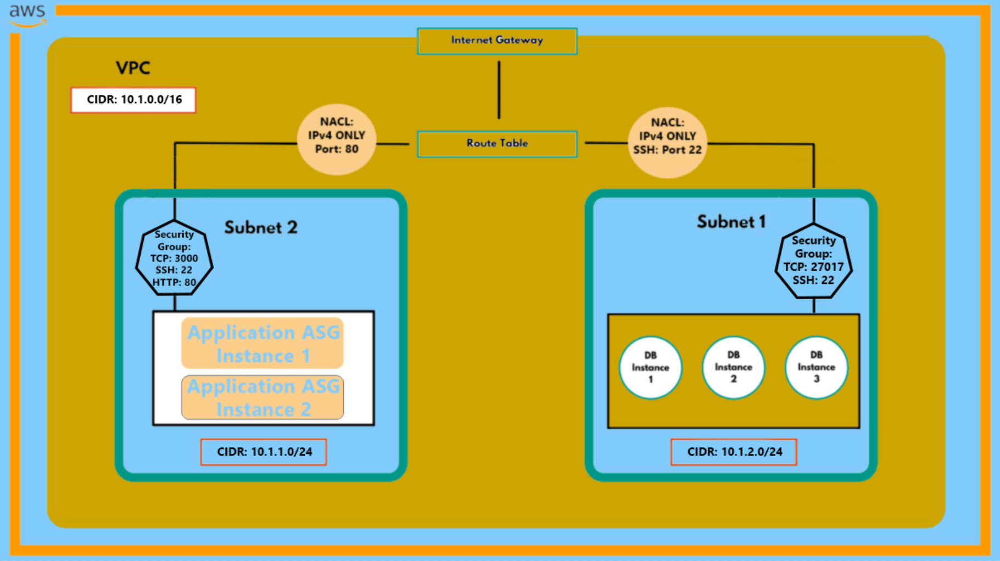

# VPC

- Virtual Private Cloud
- Secure private cloud hosted within a public cloud
- Our private cloud is isolated for us, but it's hosted in the public cloud that is AWS
- Allows us to build a virtual network without hardware or physical datacentres
  

# CIDR Blocks

- Classless Inter-Domain Routing Blocks
- Unique identifiers for networks
- Doesn't waste available IP address space
- Reduces number of routing table entries
  

# Internet Gateway 

- Node that connects two different networks that use different protocols, such as between someone's home PC network and the server network they're trying to access when they open a website
  

# Route Table

- Set of rules
- Determines where data packets will be directed in the network
  

# Subnet

- Network within a network
- Breaks down networks into smaller separate sections
- Makes it so that network traffic doesn't have to travel through the entire network and unnecessary routers on the way to reach destination
- Traffic directed towards a subnet immediately means the packets don't have to travel through the other subnets before reachings its destination

# Network ACL

- Set of rules
- Determines which type of data can access the network
- For example in our AWS security group, a Network ACL tells the network which type of data is allowed in, such as TCP packets at port 3000 or SSH data at port 22
- Main difference with security group is that security group on a per-instance basis defaults to allowing all outbound traffic
- Network ACL's protect the entire subnet and you have to specify what outbound traffic is allowed and not allowed
  

# AWS Steps

- Step 1: Create VPC (Virtual Private Cloud)
- Step 1.1: Create a valid CIDR block for our VPC (e.g. 10.0.0.0/8)
- Step 2: Create an Internet Gateway (IG)
- Step 3: Create a public subnet
- Step 3.1: Associate the new public subnet to the VPC
- Step 4: Create route tables for the public subnet to let the network know who to allow in
- Step 4.1: Edit the route table to allow traffic in from the pbulic internet gateway
- Step 4.2: Associate the route tables to the public subnet
- Step 5: Create a security group within the public subnet which allows 